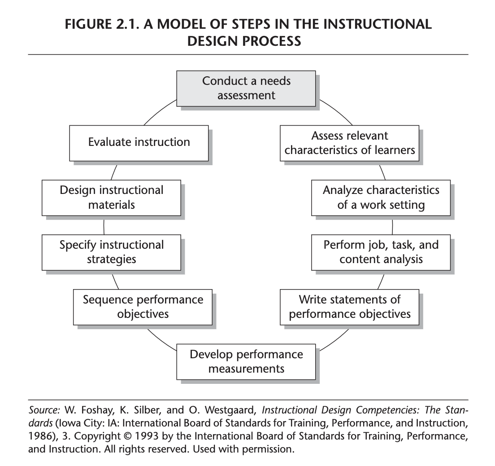
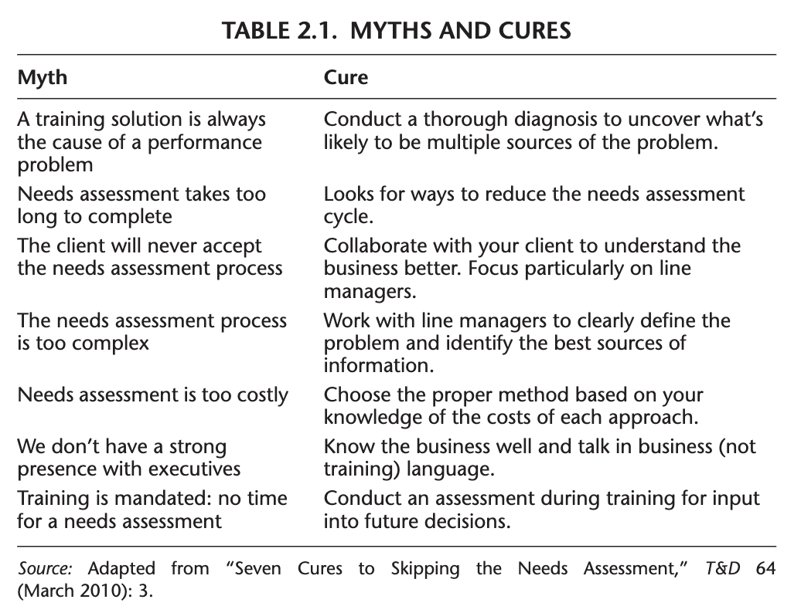
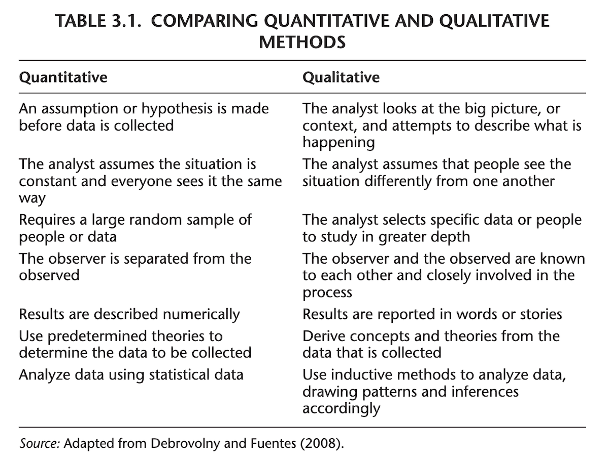
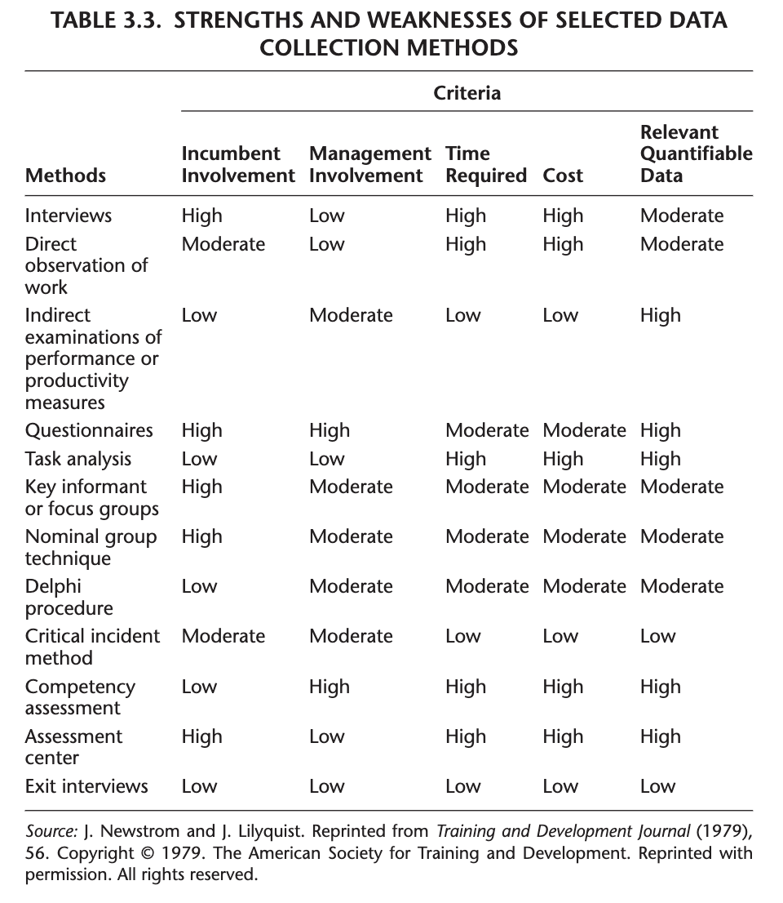
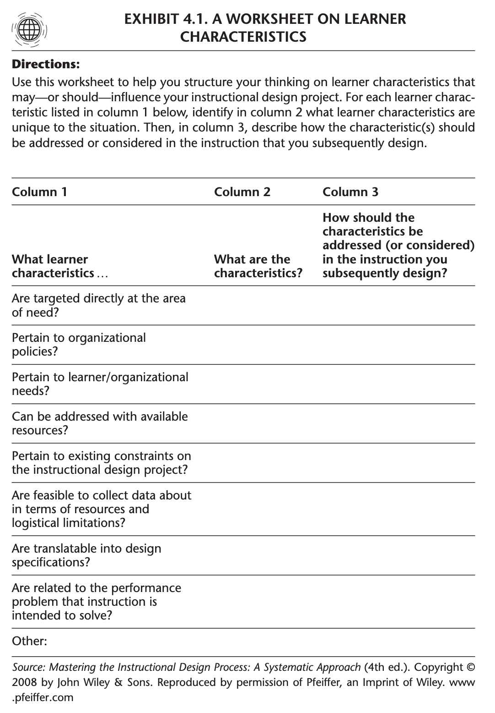
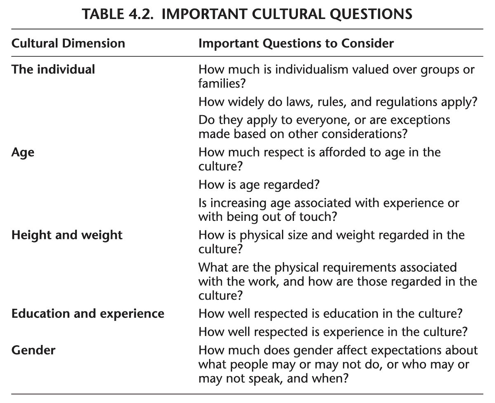
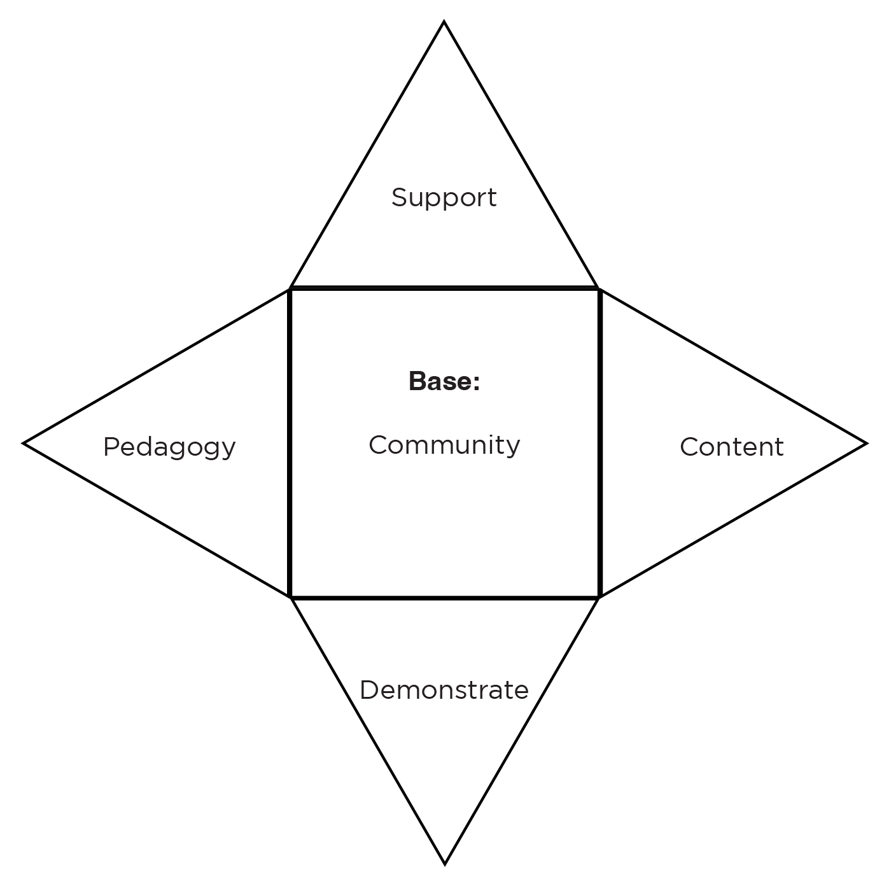
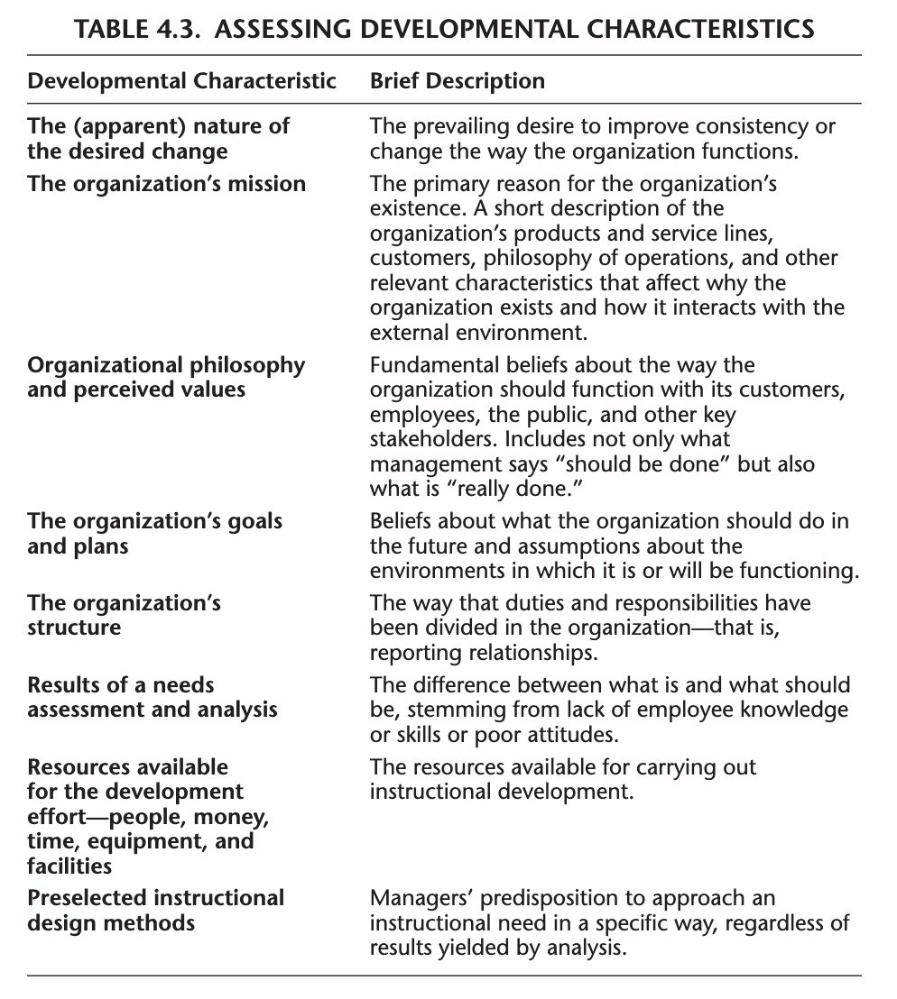

```{r setup, include=FALSE}
usethis::use_git_ignore(c("*.csv", "*.rds"))
options(htmltools.dir.version = FALSE)

library(knitr)
library(tidyverse)
library(xaringan)
library(fontawesome)
```

class: inverse, center, middle

# `r fa("fas fa-images", fill = "#fff")`

**View the slides:** 

[bretsw.com/eme5601-fs23-module4](https://bretsw.com/eme5601-fs23-module4)

---

class: inverse, center, middle

# `r fa("fas fa-person-circle-question", fill = "#fff")` <br><br> Module 4 <br> Needs Assessment

---

class: inverse, center, middle

#  `r fa("fas fa-person-circle-question", fill = "#fff")` <br><br> Why Needs Assessment?

---

#  `r fa("fas fa-person-circle-question", fill = "#fff")` Why Needs Assessment?

### `r fa("fas fa-person-hiking", fill = "#782F40")` **A Climber's Survival Tale**

<br>

<iframe src="https://www.npr.org/player/embed/101420504/101420480" width="100%" height="240px" frameborder="0" title="NPR embedded audio player"></iframe>

Source: [**NPR: Day to Day, March 4, 2009**](https://www.npr.org/2009/03/04/101420504/redux-a-climbers-survival-tale)

---

class: inverse, center, middle

# `r fa("fas fa-person-circle-question", fill = "#fff")` <br><br> Conducting a Needs Assessment <br> (Ch. 2)

---

class: inverse, center, middle

# `r fa("fas fa-arrows-left-right-to-line", fill = "#fff")` <br><br> Gap = <br><br> [What is] - [What should be]

---

# `r fa("fas fa-person-circle-question", fill = "#fff")` Needs Assessment Purpose

**Clear from the start:** What is the purpose of the needs assessment?

```{r, out.width = "100%", echo = FALSE, fig.align = "center"}
include_graphics("img/4-assessing-needs.png")
```

---

# `r fa("fas fa-person-circle-question", fill = "#fff")` Needs Assessment Purpose

Needs assessment is the **first step** in an iterative design cycle:

--

```{r, out.width = "480px", echo = FALSE, fig.align = "center"}

```

<div class="caption">
Figure 2.1 from Rothwell et al. (2016, p. 20)
<br><br>
</div>

---

# `r fa("fas fa-person-circle-question", fill = "#fff")` Instructional Myths

```{r, out.width = "640px", echo = FALSE, fig.align = "center"}

```

<div class="caption">
Table 2.1 from Rothwell et al. (2016, p. 23)
<br><br>
</div>

---

# `r fa("fas fa-person-circle-question", fill = "#fff")` Vocabulary of Needs

--

- **Need:** performance gap

--

- **Needs Assessment:** strategic level, tactical level (day-to-day operations), operational level

--

- **Needs Analysis:** underlying causes

--

- **Training Requirements Analysis:** If you know that training is the solution, why do a needs assessment? Which training is necessary? (p. 26)

--

- **Needs Assessment Planning:** comprehensive or situation-specific

--

- **Alignment:** between training assets and business goals

--

- **Position Road Map:** audiences you serve, tasks they perform, outcomes of their jobs, desired behaviors, job constraints

--

- **Needs Assessment Plan:** (like a research plan) objectives, target audience, sampling, data collection, instruments and protocols, data analysis, how decisions will be made based on the data

---

# `r fa("fas fa-person-circle-question", fill = "#fff")` Needs Assessment Steps

```{r, out.width = "480px", echo = FALSE, fig.align = "center"}
include_graphics("img/4-assessing-needs.png")
```

--

1. Establishing objectives

--

2. Identifying the target audience: Whose instructional needs are to be addressed?

--

3. Specifying instruments and protocols

--

4. Assessing the feasibility of the needs assessment plan

---

# `r fa("fas fa-person-circle-question", fill = "#fff")` Ethics in Needs Assessment

```{r, out.width = "480px", echo = FALSE, fig.align = "center"}
include_graphics("img/4-assessing-needs.png")
```

### "Can the needs assessment withstand charges it was not cost-effective, timely, or rigorous?" (p. 38)

<br><br>

--

<hr>

### `r fa("far fa-comments", fill = "#782F40")` Discuss in groups...

---

# `r fa("fas fa-person-circle-question", fill = "#fff")` Needs Across Cultures

```{r, out.width = "100%", echo = FALSE, fig.align = "center"}

```

### Are people on the train rude?


---

class: inverse, center, middle

# `r fa("fas fa-person-circle-question", fill = "#fff")` <br><br> Collecting and Analyzing Data for Instructional Design Projects <br> (Ch. 3)

---

# `r fa("fas fa-person-circle-question", fill = "#fff")` Methods for Needs

```{r, out.width = "400px", echo = FALSE, fig.align = "center"}
include_graphics("img/workshop.jpg")
```

--

- **Data:** relevancy, reliability, validity (p. 42)

--

- **Open process:** iterative, evolving based on feedback and revision

--

- **Paradigm:**

--
  - Quantitative vs. qualitative approaches

--

  - if vs. how and why

--

  - worldviews and assumptions

---

# `r fa("fas fa-person-circle-question", fill = "#fff")` Quant vs. Qual

```{r, out.width = "600px", echo = FALSE, fig.align = "center"}

```

<div class="caption">
Table 3.1 from Rothwell et al. (2016, p. 44)
<br><br>
</div>

---

# `r fa("fas fa-person-circle-question", fill = "#fff")` Sampling

```{r, out.width = "520px", echo = FALSE, fig.align = "center"}

```

--

- Convenience or Judgmental sampling

--

- Simple random sampling

--

- Stratified sampling

--

- Systematic sampling

---

# `r fa("fas fa-person-circle-question", fill = "#fff")` Data Collection

```{r, out.width = "520px", echo = FALSE, fig.align = "center"}

```

--

- Interviews

--

- Direct observations

--

- Indirect observations

--

- Questionnaires

---

# `r fa("fas fa-person-circle-question", fill = "#fff")` Data Collection

--

- Key Informant Groups or Focus groups

--

- Delphi procedure

--

- Critical incident method

--

- Root Cause Analysis (beware bias: recency, availability, anchoring, confirmation)

--

- Competency assessment

--

- Assessment center

--

- Exit interviews

--

- Performance records

--

- Work samples

--

- Process mapping

---

# `r fa("fas fa-person-circle-question", fill = "#fff")` Data Collection

- Unobtrusive measures (because many collection methods are reactive: inherently biased by their altering the situation being studied)

--

- Data Analytics

--

- Data mining

---

# `r fa("fas fa-person-circle-question", fill = "#fff")` Data Collection

```{r, out.width = "360px", echo = FALSE, fig.align = "center"}

```

<div class="caption">
Table 3.3 from Rothwell et al. (2016, p. 57)
<br><br>
</div>

--

<hr>

### `r fa("far fa-comments", fill = "#782F40")` Discuss in groups...

---

# `r fa("fas fa-person-circle-question", fill = "#fff")` Data Analysis

--

- Historical

--

- Descriptive (mean, mode, median)

--

- Fancy math (sophisticated statistical techniques)

--

  - ANOVA

--

  - chi-square

--

  - t-test

---

# `r fa("fas fa-person-circle-question", fill = "#fff")` Key Questions on Data

```{r, out.width = "480px", echo = FALSE, fig.align = "center"}
include_graphics("img/4-assessing-needs.png")
```

--

### This might be the most important slide of Module 4!

--

1. What are needs this project is attempting to satisfy?

--

2. What data or information will I need to clarify these needs?

--

3. How will I need to analyze this data to arrive at a reliable and valid conclusion?
 
(p. 59)

---

class: inverse, center, middle

# `r fa("fas fa-person-circle-question", fill = "#fff")` <br><br> Identifying the Target Population and Environmental Characteristics <br> (Ch. 4)

---

# `r fa("fas fa-person-circle-question", fill = "#fff")` Learner Assessment

--

### Who is the intended learner?

--

### What learner characteristics should be assessed?

--

- **Situation**-related characteristics:

--

  - **Performance Analysis:** What are the possible relationships between the performance problem and the learner?
  
--

- **Decision**-related characteristics

---

# `r fa("fas fa-person-circle-question", fill = "#fff")` Learner Assessment

- **Learner**-related characteristics:

--

  - Prerequisite knowledge, skills, and attitudes

--

  - Physical traits

--

  - Demographic characteristics

--

  - Learner sensitivity

--

  - Physiological characteristics

--

  - Aptitudes (future capabilities to perform in certain ways)

--

  - Experience

--

  - ~~Learning styles~~

---

# `r fa("fas fa-person-circle-question", fill = "#fff")` Learner Assessment

- **Learner**-related characteristics:

  - Geographical location

--

  - Job category

--

  - Interests

--

  - Personal benefit to learning

--

  - Culture

--

  - Life cycle stage

--

  - Career stage and/or career prospects

---

# `r fa("fas fa-person-circle-question", fill = "#fff")` Learner Assessment

- **Environmental** characteristics:

--

  - Physical

--

  - Social

--

  - Political

--

  - Cultural

---

# `r fa("fas fa-person-circle-question", fill = "#fff")` Learner Assessment

**Learner Profiles:** normative, descriptive, historical

--

```{r, out.width = "360px", echo = FALSE, fig.align = "center"}

```

<div class="caption">
Exhibit 4.1 from Rothwell et al. (2016, p. 72)
<br><br>
</div>

---

# `r fa("fas fa-person-circle-question", fill = "#fff")` Learner Assessment

### `r fa("far fa-comments", fill = "#782F40")` Discuss in groups...

```{r, out.width = "360px", echo = FALSE, fig.align = "center"}

```

<div class="caption">
Exhibit 4.1 from Rothwell et al. (2016, p. 72)
<br><br>
</div>

---

# `r fa("fas fa-person-circle-question", fill = "#fff")` Cultural Considerations 

```{r, out.width = "480px", echo = FALSE, fig.align = "center"}

```

<div class="caption">
Table 4.2 from Rothwell et al. (2016, p. 77)
<br><br>
</div>

--

### Key question: Is the learner assessment free of bias and stereotyping?

---

# `r fa("fas fa-person-circle-question", fill = "#fff")` Setting Analysis

--

- physical system

--

- environment (developmental, delivery, application)

--

- context

--

- situation

--

- **Whole Task Instructional Design**

--

- **Universal Instructional Design:** inclusive rather than exclusive perspective

--

  - class climate

--

  - interaction

--

  - physical environments and products

--

  - delivery methods

--

  - assessment and feedback

--

  - accommodation

---

# `r fa("fas fa-person-circle-question", fill = "#fff")` Setting Analysis

### UID `r fa("fas fa-arrow-right", fill = "#782F40")` Culturally Sustaining Instructional Design

```{r, out.width = "480px", echo = FALSE, fig.align = "center"}

```

---

# `r fa("fas fa-person-circle-question", fill = "#fff")` Developmental Assessment

```{r, out.width = "420px", echo = FALSE, fig.align = "center"}

```

<div class="caption">
Table 4.3 from Rothwell et al. (2016, p. 80)
<br><br>
</div>

---

# `r fa("fas fa-person-circle-question", fill = "#fff")` Setting Analysis

--

### Key questions: 

--

- Based on what is known about the organization, how many of these characteristics relate to the present assignment?

--

- How are the characteristics relevant? What is known about how each characteristic effects on-the-job performance?

--

- How should information about these characteristics subsequently be used in the instructional design process to improve the chances that learners will apply on the job what they learned during instruction? 

--

- How should this information influence subsequent steps in the instructional design model?

(p. 87)

---

class: inverse, center, middle

# `r fa("fas fa-person-circle-question", fill = "#fff")` <br><br> Using Analytical Techniques to Determine Instructional Content <br> (Ch. 5)

---

# `r fa("fas fa-person-circle-question", fill = "#fff")` Instructional Content

--

- **Synthesize** (bring together) pieces of the puzzle in an efficient manner

--

- **Ask**: Do the instructional products appear to meet the organization's needs?

--

- **Sequence** the instruction: What should be addressed first?

--

  - Chronological

--

  - Topical

--

  - Whole-to-Part

--

  - Part-to-Whole

--

  - Know-to-Unknown

--

  - Unknown-to-Known

--

  - Step-by-Step

--

  - Part-to-Part-to-Part

--

  - General-to-Specific

---

# `r fa("fas fa-person-circle-question", fill = "#fff")` Instructional Content

```{r, out.width = "720px", echo = FALSE, fig.align = "center"}

```

--

- Analyze content through thematic analysis: 

--

  - "goodness of fit" to meet performance standards

---

class: inverse, center, middle

# `r fa("fas fa-toolbox", fill = "#fff")` <br><br> Expanding the <br> ISD Analysis Toolbox

---

# `r fa("fas fa-toolbox", fill = "#fff")` ISD Analysis Toolbox

```{r, out.width = "450px", echo = FALSE, fig.align = "center"}
include_graphics("img/toolbench.jpg")
```

--

- Systems Analysis
- Performance Analysis
- Needs Assessment / Needs Analysis
- Training Requirements Analysis
- Root Cause Analysis
- Competency Assessment
- Learner Assessment
- Setting Analysis
- Developmental Setting Assessment

---

class: inverse, center, middle

# `r fa("fas fa-arrows-left-right-to-line", fill = "#fff")` <br><br> Gap = <br><br> [What is] - [What should be]

---

class: inverse, center, middle

# `r fa("fas fa-binoculars", fill = "#fff")` <br><br> Looking ahead

---

# `r fa("fas fa-calendar-day", fill = "#fff")` Semester Schedule

```{r, out.width = "480px", echo = FALSE, fig.align = "center"}
include_graphics("img/across-time.jpg")
```

- **Module 1:** Introduction to Instructional Systems Design

- **Module 2:** Systems Analysis

- **Module 3:** ISD & HPT

- **Module 4: Needs Assessment**

- **Module 5:** Work Analysis

- **Module 6:** Design & Development

- **Module 7:** Evaluation

---

# `r fa("fas fa-list", fill = "#fff")` Module Structure

```{r, out.width = "540px", echo = FALSE, fig.align = "center"}
include_graphics("img/workshop.jpg")
```

- `r fa("fas fa-video", fill = "#782F40")` Optional Office Hours: **Wednesdays 2:30-3:00pm ET**

- `r fa("fas fa-book-open", fill = "#782F40")` Read

- `r fa("far fa-comments", fill = "#782F40")` Meet: **Wednesdays 3:05-5:40pm ET**

- `r fa("fas fa-keyboard", fill = "#782F40")` Create

---

# `r fa("far fa-keyboard", fill = "#fff")` Major Assignments

```{r, out.width = "320px", echo = FALSE, fig.align = "center"}
include_graphics("img/build.jpg")
```

- **Assignments** (70%)

  - Module 2 Assignment: Systems Analysis paper (150 points)

  - Module 3 Assignment: Annotated Bibliography 1 (50 points)

  - **Module 4 Assignment: Needs Assessment paper (150 points)**

  - Module 5 Assignment: Annotated Bibliography 2 (50 points)

  - Module 6 Assignment: Work Analysis paper (150 points)

  - Module 7 Assignment: ISD Process Model paper (150 points)

---

class: inverse, center, middle

# `r fa("fas fa-question", fill = "#fff")` <br><br> Questions

<hr>

**What questions can I answer for you now?**

**How can I support you this week?**

<hr>

`r fa("fas fa-envelope", fill = "#fff")` [bret.staudtwillet@fsu.edu](mailto:bret.staudtwillet@fsu.edu) | `r fa("fas fa-globe", fill = "#fff")` [bretsw.com](https://bretsw.com) | `r fa("fab fa-github", fill = "#fff")` [GitHub](https://github.com/bretsw/)